  

  
<h1 align="center">Welcome to <a href="https://github.com/muzammilsharf">Muhammad Muzammil</a>'s Profile 👋</h1>

  

### About me<picture style="margin-right: 10px;"></picture>

- Hi Everyone, I'm **Muhammad Muzammil** 🗻
- Currently Machine Learning Engineer Intern at **FlyRank AI** 💼
- Software Engineering Undergrad at NUML 👨‍🎓
- Focusing on Artificial Intelligence, LLM Systems & RAG Pipelines 🤖
- Experienced in training, optimizing, and deploying production ML models ⚡
- Feel free to explore my repositories! 🍨

### Social Profiles 💻

  
  
  
  

### Tech Stack 🛠️

### Popular Projects 📂

  
  

### Live Stats & Top Languages 📊

  
  

  

#### Activity Graph 📈

  

**Last Updated:** July 19, 2026
